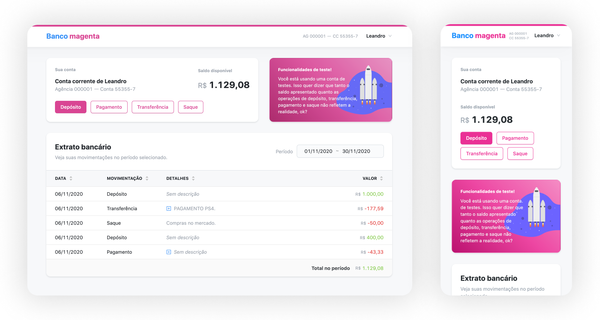

# Banco magenta (Warren challenge)
Magenta bank. Simulates a bank account control system, processing deposit requests, withdraws and payments. It also has the ability to monetize the current account balance from one day to another.

## App screenshot


## App overview
General project overview:
- Responsive app (works on mobile)
- Uses [AdonisJS](https://preview.adonisjs.com) for backend
- Uses [NuxtJS](https://nuxtjs.org) for frontend (VueJS)
- Uses MySQL as database for storage information
- Backend tests running under [Japa](https://github.com/thetutlage/japa)
- Deploy/production architecture is done using heroku (front and backend)

## Backend REST API
The backend was built using [AdonisJS](https://preview.adonisjs.com), a NodeJS framework very similar to Laravel, Rails and also Django. All the application logic is placed here. Transactions, wallet balance, authentication, users, etc.

#### About backend
Some of the backend app highlights:
- Typescript
- MVC model
- ORM pattern
- Service Layer responsible for handling info (it could has a repository pattern but it would be an overhead)
- Development env uses Docker/docker-compose

#### Available routes
| Route                      | Method | Handler                                      | Middleware |
|----------------------------|:------:|----------------------------------------------|:----------:|
| /api/auth/signup           |  POST  | ```AuthController.signUp```                  |            |
| /api/auth/signin           |  POST  | ```AuthController.signIn```                  |            |
| /api/auth/signout          |  POST  | ```AuthController.signOut```                 |            |
| /api/transactions/history  |   GET  | ```TransactionController.getWalletHistory``` |    auth    |
| /api/transactions/payment  |  POST  | ```TransactionController.payment```          |    auth    |
| /api/transactions/deposit  |  POST  | ```TransactionController.deposit```          |    auth    |
| /api/transactions/transfer |  POST  | ```TransactionController.transfer```         |    auth    |
| /api/transactions/withdraw |  POST  | ```TransactionController.withdraw```         |    auth    |
| /api/users/me              |   GET  | ```UserController.me```                      |    auth    |
| /api/wallets               |   GET  | ```WalletController.getUserWallet```         |    auth    |

#### Running local with Docker/docker-compose
Follow the steps below and get this API running locally:
1. ```$ cd backend```
2. ```$ cp .env.example .env```
3. ```$ docker-compose up -d``` > Builds images and get containers running in background
4. ```$ docker-compose exec warren-api sh``` > Enter in docker api container
5. ```$ node ace migration:run``` > Inside container, run migrations (create db tables)
>> At this point the API is running on localhost:3333/api and MySQL8 is running on localhost:3306.

#### Running tests
After get running local, to run tests simple do:
1. ```$ docker-compose exec warren-api sh``` > Enter in docker api container
2. ```$ mkdir tmp && touch tmp/db.sqlite3``` > Create sqlite3 database for testing
3. ```$ npm run tests``` > check console output

#### Troubleshooting
Since adonisjs uses typescript and runs from build directory (which contains all compiled javascript files), some build problems can occur. If this happens, try rebuilding the app and running up server again. You can also read the [Adonisjs docs](https://preview.adonisjs.com/guides).
1. ```$ docker-compose exec warren-api sh```
2. ```$ npm run build```

You can also face problems using docker. If this happens, try to remove all containers and rebuild again:
1. ```$ docker-compose rm -v```
2. ```$ docker-compose build --no-cache --force-rm```
3. ```$ docker-compose up --remove-orphans```

## Frontend NuxtJS (Vue)
The frontend app was built under [NuxtJS](https://nuxtjs.org) using Typescript for most part of application. It is as dummy as possible, meaning is only responsible for sending/getting backend info. It doesn't calculate anything.

#### About frontend
Some of the front app highlights:
- Vue under the hood
- Vuex modules to handle app state
- API layer to connect to backend
- Built-in Nuxt auth module
- Nuxt transiction to add a nice loading state
- Uses LESS to handle styles (and categories colors)
- Uses [vue-ant-design](https://antdv.com/components) as design system (components)

#### Running local
Follow the steps below and get the frontend running locally on port 3000.
1. ```$ cd frontend```
2. ```$ cp .env.example .env```
3. ```$ npm i```
4. Change .env API_URL and API_URL_BROWSER to http://localhost:3333/api (or backend URL above)
5. ```$ npm run dev``` > Frontend running on localhost:3000
>> At this point frontend running on localhost:3000.

## Daily monetization
Backend comes with a builtin command that monetizes all wallet balances daily. It is not a problem run twice or more a day because command prevents duplication monetization. Must be run inside docker-container.
1. ```$ cd backend```
2. ```$ docker-compose exec warren-api sh```
3. ```$ node ace monetize:balance:daily``` > Runs commands/MonetizeBalanceDaily.ts

## Deployment (back and frontend)
Current deployment process relies on Heroku. Since we have both frontend and backend applications running at the same git repository, different master branches had to be added to each project [as described here](https://adampaxton.com/how-to-deploy-to-multiple-heroku-apps-from-the-same-git-repository/). To deploy you must go to project directory and run the ```deploy:heroku``` command, like so:
1. ```$ cd backend or frontend```
2. ```$ npm run deploy:heroku``` > For backend only, tests will be run before.

This process only deploys a new version if current branch has changes. You also must be logged and have permissions inside Heroku in order to get this done.

## Possible improvements
Since this is a MVP version, both backend and frontend can has improvements. Here are some examples.

#### Frontend
- Tests: add testing layer to ensure actions are working well
- Known issue: input currency does not work on Safari

#### Backend
- Encrypt all user data on database
- Implement 2-fac authentication
- Throw exceptions on service methods instead of returning false
- Create a schedule/cron job that runs command to monetize balance every day
- CI: Attach a set of steps to ensure everything is fine with the application build on deployment process;
- CD: Deploy backend automatically when a push/merge occurs on specific git branch - I would do this but I lack permissions on this repository
